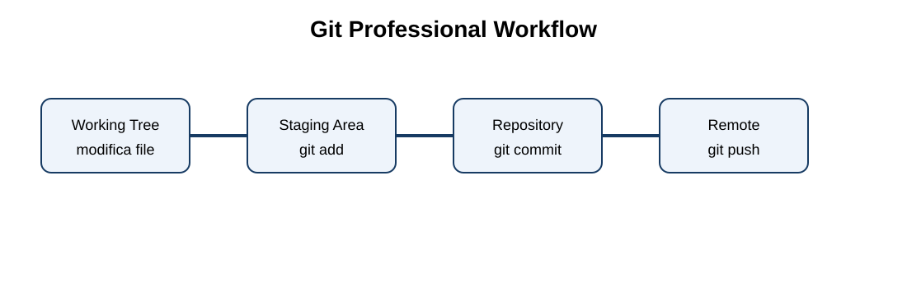
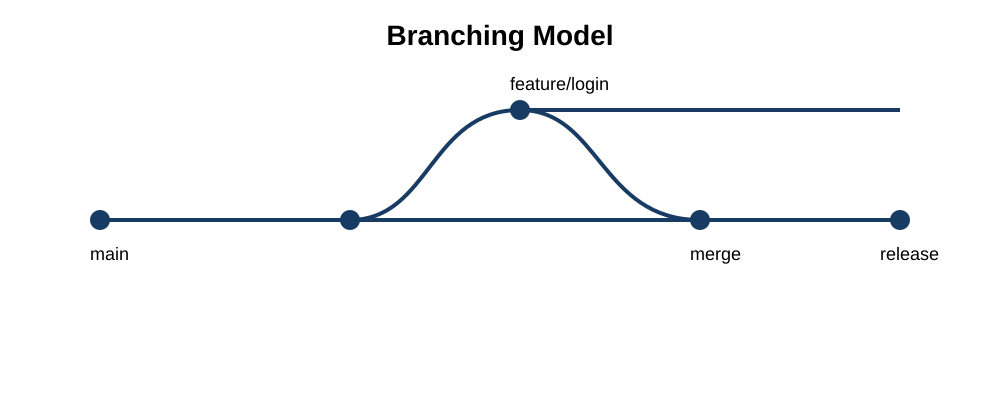
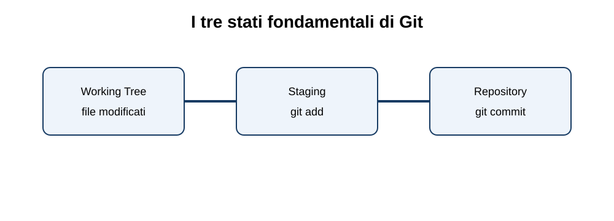

# Git CLI Professionale

Corso completo e progressivo per imparare Git dalla prima repository fino al workflow professionale di team.

**Docente:** Moussa Salisou

## Obiettivi
- comprendere working tree, staging area, repository e remote
- usare i comandi Git dalla CLI
- lavorare con branch e merge
- gestire conflitti e recuperare errori
- collaborare con GitHub
- applicare workflow professionali

## Percorso
00 Fondamenti · 01 Repository · 02 Storia · 03 Branch · 04 GitHub · 05 Conflitti · 06 Annullare · 07 Stash · 08 Tag/Release · 09 Avanzato · 10 Gitignore · 11 Workflow · 12 GitHub CLI · 13 Esercizi · 14 Progetto finale · 15 Cheatsheet · 16 Glossario · 17 Docente · 18 Laboratori · 19 Quiz

## Diagrammi

## Metodo
Ogni comando viene affrontato attraverso: cos'è, scopo, motivazione, sintassi, opzioni, esempi, errori comuni, esercizi, soluzioni e buone pratiche.
